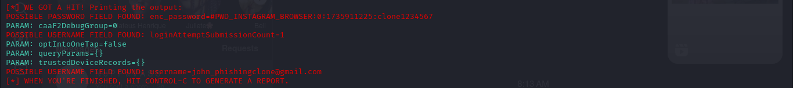

# Phishing para Captura de Senhas do Facebook (Instagram)

Este projeto tem como objetivo educacional demonstrar como um ataque de phishing pode ser realizado para capturar senhas, utilizando como exemplo a clonagem de uma página de login do Instagram. O intuito é conscientizar sobre os riscos de ataques de phishing e como se proteger contra eles. **É importante ressaltar que este projeto deve ser usado apenas para fins educacionais e em ambientes controlados, com autorização explícita.**

---

## Ferramentas

- **Kali Linux**: Uma distribuição Linux amplamente utilizada para testes de segurança e hacking ético.
- **setoolkit (Social-Engineer Toolkit)**: Uma ferramenta de código aberto projetada para simular ataques de engenharia social, como phishing.

---

## Configurando o Phishing no Kali Linux

Siga os passos abaixo para configurar um ataque de phishing no Kali Linux:

1. **Acesso root:**
   - Para executar o setoolkit com permissões elevadas, use o comando:
     ```bash
     sudo su
     ```

2. **Iniciando o setoolkit:**
   - Inicie o setoolkit com o comando:
     ```bash
     setoolkit
     ```

3. **Tipo de ataque:**
   - No menu do setoolkit, selecione a opção:
     ```
     1) Social-Engineering Attacks
     ```

4. **Vetor de ataque:**
   - Escolha o vetor de ataque:
     ```
     2) Web Site Attack Vectors
     ```

5. **Método de ataque:**
   - Selecione o método de ataque para captura de credenciais:
     ```
     3) Credential Harvester Attack Method
     ```

6. **Método de clonagem de site:**
   - Escolha a opção para clonar um site:
     ```
     2) Site Cloner
     ```

7. **Obtendo o endereço da máquina:**
   - Para obter o endereço IP da sua máquina, use o comando:
     ```bash
     ifconfig
     ```
   - Anote o endereço IP exibido (por exemplo, `192.168.1.100`).

8. **URL para clone:**
   - Insira a URL do site que deseja clonar. Neste exemplo, usaremos o Instagram:
     ```
     http://www.instagram.com
     ```

---

## Resultados

Após configurar o ataque de phishing, o setoolkit criará uma cópia da página de login do Instagram no endereço IP da sua máquina. Quando alguém acessar esse endereço e inserir suas credenciais, as informações serão capturadas e exibidas no terminal do setoolkit.



---

## Como Usar Este Projeto para Aprendizado

1. **Clonar o Ambiente:**
   - Utilize uma máquina virtual ou um ambiente controlado para realizar este projeto, garantindo que não haja riscos para terceiros.

2. **Analisar o Funcionamento:**
   - Estude como o setoolkit clona a página e captura as credenciais.
   - Entenda os métodos de engenharia social utilizados em ataques de phishing.

3. **Proteção Contra Phishing:**
   - Aprenda a identificar páginas de phishing (verifique o endereço URL, use autenticação de dois fatores, etc.).
   - Utilize ferramentas de segurança, como antivírus e extensões de navegador que detectam phishing.

4. **Documentar e Compartilhar:**
   - Documente suas observações e aprendizados em um arquivo `README.md` no repositório.
   - Compartilhe seu repositório no GitHub para conscientizar outras pessoas sobre os riscos de phishing.

---

## Aviso Legal

Este projeto é estritamente para fins educacionais e deve ser realizado apenas em ambientes controlados e com autorização explícita. O uso indevido dessas técnicas para atividades maliciosas é ilegal e antiético. O objetivo é promover a conscientização e a educação em segurança cibernética.

---

## Contribuições

Contribuições são bem-vindas! Se você tiver sugestões para melhorar este projeto ou quiser adicionar novos recursos, sinta-se à vontade para abrir uma issue ou enviar um pull request.

---

## Licença

Este projeto está licenciado sob a licença MIT. Consulte o arquivo `LICENSE` para mais detalhes.

---

Ao seguir este projeto, você entenderá como os ataques de phishing funcionam e como se proteger contra eles. Lembre-se: conhecimento é a melhor defesa!
