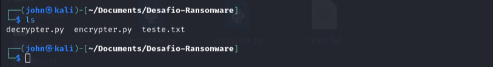
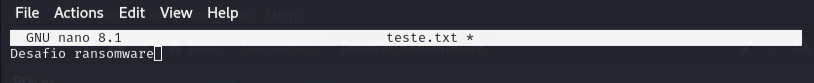
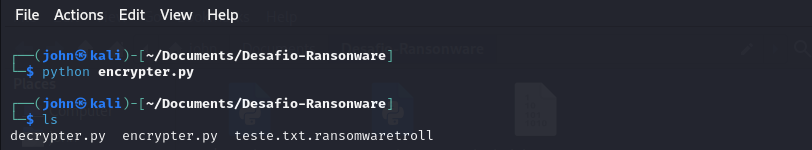
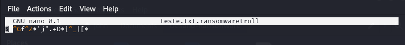
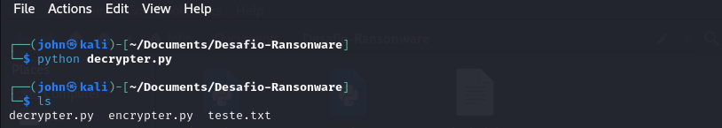

# Entendendo um Ransomware na Prática

Este projeto tem como objetivo educacional fornecer uma compreensão prática de como um ransomware funciona, focando na criptografia e descriptografia de arquivos. Ao seguir os passos descritos, os usuários podem aprender sobre técnicas básicas de criptografia, manipulação de arquivos e segurança cibernética.

## Ferramentas

- **Kali Linux**: Uma distribuição Linux amplamente utilizada para testes de segurança e hacking ético.
- **Python**: Uma linguagem de programação versátil e de fácil aprendizado.
- **Pacote pyaes**: Uma biblioteca Python para implementação do algoritmo AES (Advanced Encryption Standard), um padrão de criptografia amplamente utilizado.

## Instalando Pyaes no Kali Linux

Para instalar o pacote `pyaes` no Kali Linux, execute os seguintes comandos no terminal:

```bash
sudo apt update
sudo apt install python3-pyaes
```

### Desafio

O desafio consiste em entender e praticar a criptografia e descriptografia de um arquivo de texto utilizando scripts Python. Abaixo estão os passos para realizar o desafio:

1. **Exibindo o conteúdo do diretório:**
   - **Script de descriptografia em Python (`decrypter.py`)**
   - **Script de criptografia em Python (`encrypter.py`)**
   - **Arquivo com um texto comum (`teste.txt`)**

   

2. **Conteúdo do `teste.txt`:**
   - O arquivo contém a mensagem: "Desafio ransomware".

   

3. **Criptografando a mensagem:**
   - Execute o script `encrypter.py` para criptografar o conteúdo do arquivo `teste.txt`.
   - Após a criptografia, o nome do arquivo será alterado para `teste.txt.ransomwaretroll`.

   

4. **Conteúdo do `teste.txt.ransomwaretroll`:**
   - O conteúdo do arquivo agora está criptografado e aparece como símbolos aleatórios.

   

5. **Descriptografando a mensagem:**
   - Execute o script `decrypter.py` para descriptografar o conteúdo do arquivo `teste.txt.ransomwaretroll`.
   - Após a descriptografia, o nome do arquivo será alterado de volta para `teste.txt`.

   

6. **Verificação da descriptografia:**
   - O conteúdo do arquivo `teste.txt` agora está legível novamente, exibindo a mensagem original: "Desafio ransomware".

   

## Como Usar Este Projeto para Aprendizado

1. **Clonar o Repositório:**
   - Clone este repositório para o seu ambiente local usando o comando:
     ```bash
     git clone https://github.com/seu-usuario/entendendo-ransomware.git
     ```

2. **Explorar os Scripts:**
   - Analise os scripts `encrypter.py` e `decrypter.py` para entender como a criptografia e descriptografia são implementadas.
   - Modifique os scripts para experimentar com diferentes algoritmos de criptografia ou para adicionar funcionalidades extras.

3. **Executar os Scripts:**
   - Siga os passos descritos no desafio para criptografar e descriptografar o arquivo `teste.txt`.
   - Observe como o conteúdo do arquivo muda após cada etapa.

4. **Documentar e Compartilhar:**
   - Documente suas observações e aprendizados em um arquivo `README.md` no repositório.
   - Compartilhe seu repositório no GitHub para que outros possam aprender com o seu trabalho.

## Contribuições

Contribuições são bem-vindas! Se você tiver sugestões para melhorar este projeto ou quiser adicionar novos recursos, sinta-se à vontade para abrir uma issue ou enviar um pull request.

## Licença

Este projeto está licenciado sob a licença MIT. Consulte o arquivo `LICENSE` para mais detalhes.

---

Este projeto é uma ferramenta educacional e não deve ser usado para atividades maliciosas. O objetivo é promover o aprendizado e a conscientização sobre segurança cibernética.
