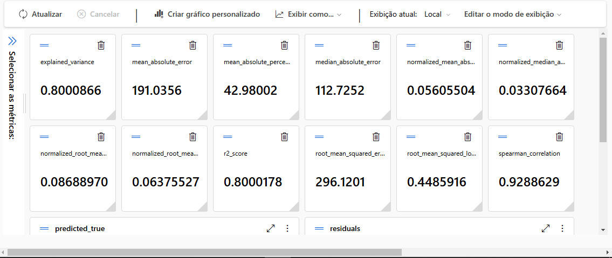
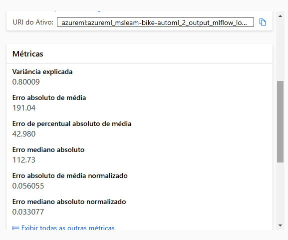
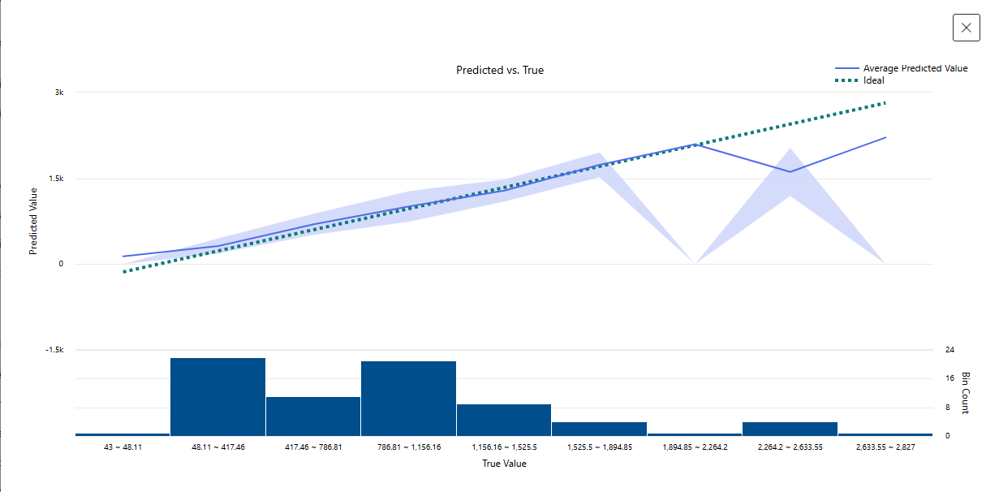
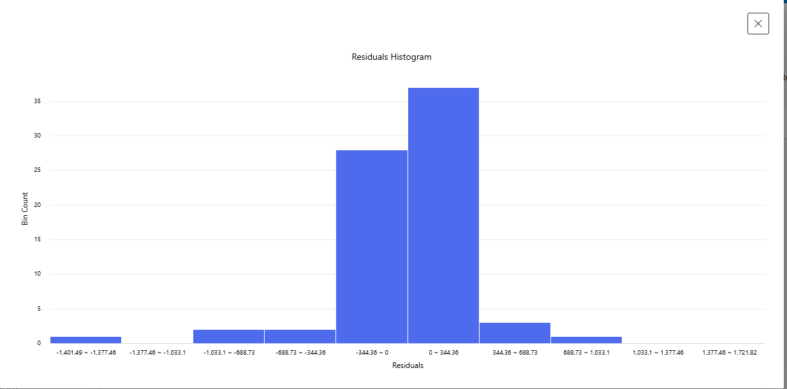

# Desafio 1 - Bootcamp Microsoft Fundamentos AI

## Trabalhando com Machine Learning no Azure ML

---

## Descrição
Este projeto é um laboratório de aprendizado em Azure Machine Learning, focado na previsão de aluguéis de bicicletas com base em dados históricos. O objetivo é aplicar técnicas de aprendizado de máquina para melhorar a precisão das previsões.

---

## Estrutura do Projeto
O projeto está organizado da seguinte forma:

      /
      ├── assets/ # Pasta para armazenar recursos visuais
      │ └── prints/ # Prints dos testes realizados
      └── README.md # Documentação do projeto

---

## Processo de Criação
O projeto foi desenvolvido usando o **Automated Machine Learning (AutoML)** do Azure em várias etapas principais:

1. **Configuração do trabalho AutoML**: Criação de um novo trabalho com configurações básicas.
2. **Conjunto de dados**: Upload de dados históricos de aluguéis, configurando armazenamento no Azure Blob.
3. **Definição da tarefa**: Configuração para regressão, seleção da coluna alvo e uso de modelos RandomForest e LightGBM.
4. **Computação**: Configuração de máquinas virtuais serverless.
5. **Execução**: Envio e monitoramento do trabalho.

O AutoML automatiza treinamento e avaliação, otimizando modelos de forma eficiente. O conjunto de dados inclui fatores sazonais e meteorológicos.

---

## Configuração do Workspace

1. Acesse o [Portal Azure](https://portal.azure.com) e crie um novo recurso **Azure Machine Learning** com:
   - **Grupo de recursos:** Novo ou existente.
   - **Região:** Próxima à sua localização.
   - **Configurações padrão:** Armazenamento, chave, e insights.
2. Após criar o recurso, acesse o Azure ML Studio via [https://ml.azure.com](https://ml.azure.com).

---

## Treinando o Modelo

1. Vá para **Automated ML** no Azure ML Studio e configure:
   - **Nome do trabalho:** `mslearn-bike-automl`
   - **Tipo de tarefa:** Regressão
   - **Conjunto de dados:** Dados históricos de aluguéis de bicicletas ([dados](https://aka.ms/bike-rentals)).
   - **Configurações de métricas e modelos:** Erro quadrático médio com RandomForest e LightGBM.
2. Envie o trabalho e aguarde a execução.

---

## Avaliando o Modelo

Após o treinamento, explore o modelo:

1. Acesse a guia "Visão Geral" e veja o resumo do melhor modelo.
   
2. Analise as métricas e gráficos de desempenho, como resíduos e valores previstos vs. reais.

---

## Implantação

1. Implante o modelo como serviço Web:
   - **Nome:** `prever-alugueis`
   - **Tipo de Computação:** Instância de Contêiner do Azure
   - **Autenticação:** Habilitada

### Métricas

---

**Previsto**

---

**Residuais**

---

## Ferramentas Utilizadas
- **Azure Machine Learning**: Para criação, treinamento e implantação de modelos.
- **AutoML**: Para automatizar o processo de machine learning.
- **Azure Blob Storage**: Para armazenamento de dados.

---

## Aprendizados
- **Configuração do Azure ML**: Aprendemos a configurar um workspace e recursos no Azure.
- **Uso de AutoML**: Exploramos como o AutoML pode automatizar o processo de machine learning.
- **Avaliação de Modelos**: Analisamos métricas e gráficos para entender o desempenho do modelo.
- **Implantação de Modelos**: Aprendemos a implantar modelos como serviços web.

---

## Como Replicar o Projeto
Siga os passos abaixo para replicar este projeto:

1. **Crie um Recurso no Azure ML**:
   - Siga as instruções na seção [Configuração do Workspace](#configuração-do-workspace).

2. **Prepare os Dados**:
   - Baixe os dados históricos de aluguéis de bicicletas ([dados](https://aka.ms/bike-rentals)).
   - Organize os dados na pasta `inputs`.

3. **Execute o AutoML**:
   - Siga as instruções na seção [Treinando o Modelo](#treinando-o-modelo).

4. **Avalie o Modelo**:
   - Analise as métricas e gráficos gerados.

5. **Implante o Modelo**:
   - Siga as instruções na seção [Implantação](#implantação).

6. **Documente e Compartilhe**:
   - Documente os resultados e compartilhe o projeto.

---

## Links Úteis
- [Documentação Oficial do Azure Machine Learning](https://docs.microsoft.com/en-us/azure/machine-learning/)
- [Visite o Azure ML Studio](https://ml.azure.com/)
- [Azure Blob Storage - Visão Geral](https://azure.microsoft.com/en-us/services/storage/blobs/)

---

## Conclusão
Este projeto demonstrou como utilizar o Azure Machine Learning e o AutoML para prever aluguéis de bicicletas com base em dados históricos. Com os passos detalhados, é possível replicar e expandir este projeto para diversas aplicações de machine learning.
