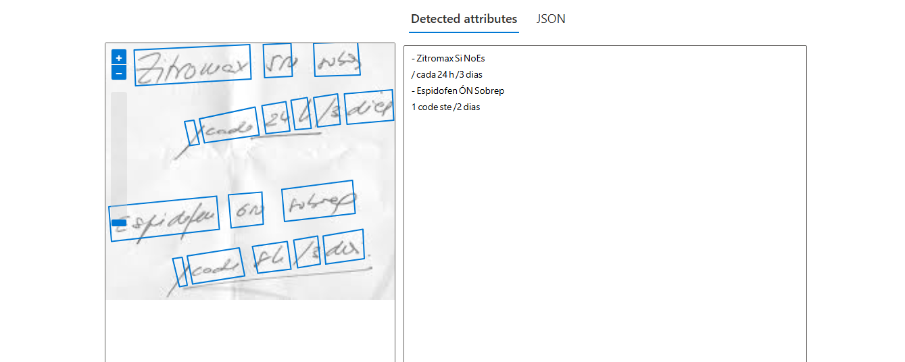

# Desafio 2 - Bootcamp Microsoft Fundamentos AI

## Reconhecimento Facial e Transformação de Imagens em Dados no Azure ML

### Objetivo
Explorar o Azure AI Visual para reconhecimento de **imagens** e **texto** utilizando ferramentas como OCR (Optical Character Recognition) e Vision Studio. O objetivo é entender como essas ferramentas podem ser aplicadas para extrair informações valiosas de imagens e textos, além de aprender a configurar e utilizar esses recursos no ambiente Azure.

---

## Estrutura do Projeto
O projeto está organizado da seguinte forma:

      /
      ├── assets/ # Pasta para armazenar recursos visuais
      │ └── prints/ # Prints dos testes realizados
      ├── inputs/ # Pasta para armazenar as imagens de teste
      ├── outputs/ # Pasta para armazenar os arquivos JSON gerados
      └── README.md # Documentação do projeto

---

## Passo a Passo

### 1. Criando um Recurso no Azure AI Service
1. Acesse o [Portal do Azure](https://portal.azure.com/).
2. Navegue até **Azure AI Service** e clique em **Criar Recurso**.
3. Escolha ou crie um **Grupo de Recursos**.
4. Preencha os campos:
   - **Nome**: Insira um nome exclusivo.
   - **Região**: `East US`.
   - **Tipo de Preço**: `Standard S0`.
5. Marque a opção para aceitar os termos e clique em **Criar**.
6. Após a criação, clique em **Ir para Recurso**.
7. Dentro do recurso, selecione a opção **Vision**.
8. Clique em **Go to Documentation** para acessar a área de teste.

### 2. Testando Reconhecimento Visual
1. Acesse a funcionalidade de **Optical Character Recognition (OCR)**:
   - **OCR**: Extraia texto de imagens.
     
   - **Análise de Face**: Detecte rostos em imagens.
     
   - **Adicionar Legendas**: Gere legendas para descrever o conteúdo das imagens.
     
2. Faça upload das imagens da pasta `inputs` e analise os resultados.

### 3. Analisando os Resultados
- Os testes geram arquivos JSON na pasta `outputs` com os dados extraídos.
- Verifique a precisão dos modelos de reconhecimento comparando os resultados com as imagens originais.

---

## Ferramentas Utilizadas
- **Azure AI Visual**: Para visão computacional e análise de imagens.
- **OCR (Optical Character Recognition)**: Para extrair texto de imagens.
- **JSON**: Para armazenar e estruturar os resultados.

---

## Aprendizados
- **Configuração de Recursos no Azure**: Aprendemos a criar e configurar recursos no Azure AI Service.
- **Utilização de OCR**: Exploramos como extrair texto de imagens.
- **Análise de Faces**: Detectamos rostos e características faciais.
- **Geração de Legendas**: Geramos descrições automáticas para imagens.

---

## Como Replicar o Projeto
Siga os passos abaixo para replicar este projeto:

1. **Crie um Recurso no Azure AI Service**:
   - Siga as instruções na seção [Passo a Passo](#passo-a-passo).

2. **Prepare as Imagens de Teste**:
   - Colete imagens variadas e organize-as na pasta `inputs`.

3. **Execute os Testes**:
   - Utilize as ferramentas de OCR, análise de faces e geração de legendas.

4. **Analise os Resultados**:
   - Verifique os arquivos JSON na pasta `outputs`.

5. **Documente e Compartilhe**:
   - Documente os resultados e compartilhe o projeto.

---

## Links Úteis
- [Documentação Oficial do Azure AI Vision](https://docs.microsoft.com/en-us/azure/cognitive-services/computer-vision/)
- [Visite o Vision Studio](https://visionstudio.azure.net/)
- [Azure AI Services - Visão Geral](https://azure.microsoft.com/en-us/services/cognitive-services/)

---

## Conclusão
Este projeto demonstrou como utilizar as ferramentas de visão computacional do Azure para extrair informações valiosas de imagens e textos. Com os passos detalhados, é possível replicar e expandir este projeto para diversas aplicações, desde a digitalização de documentos até a análise de imagens complexas.
